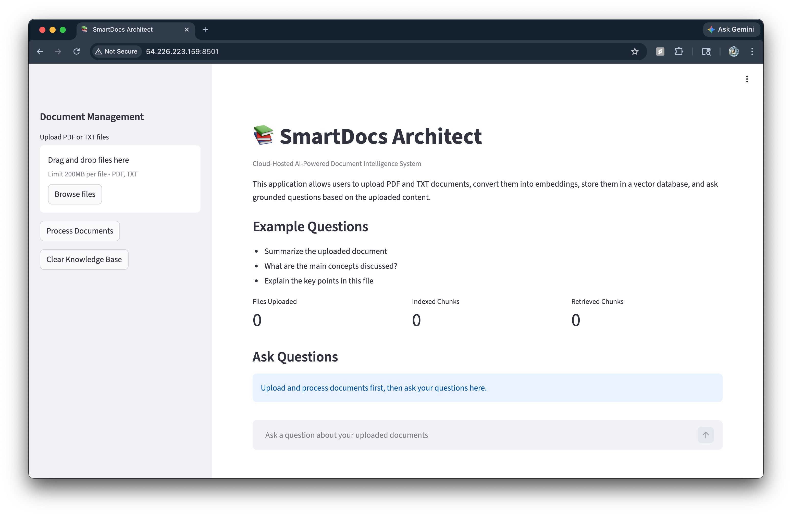
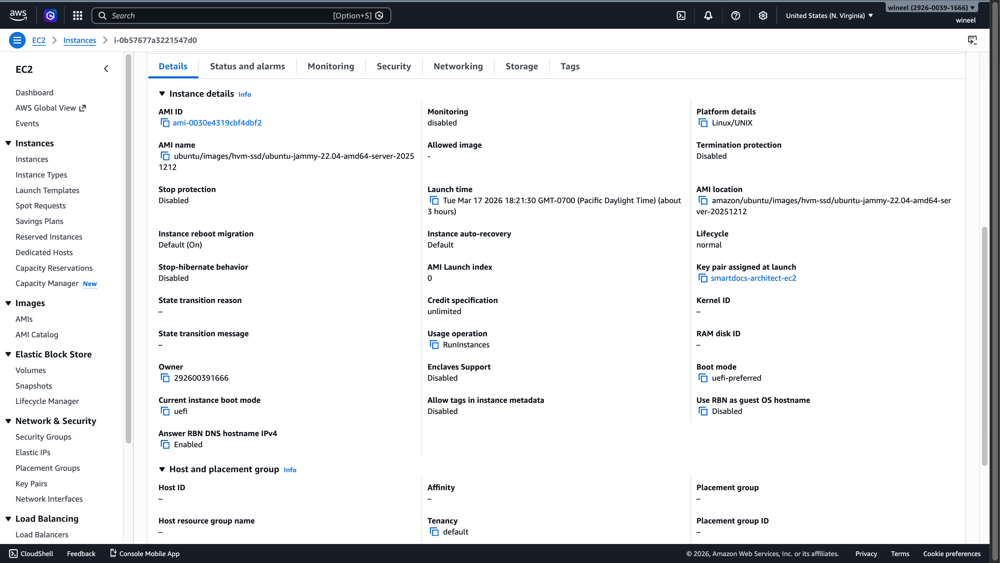
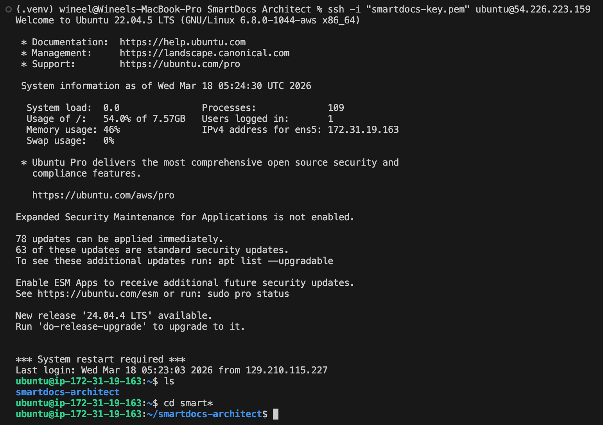
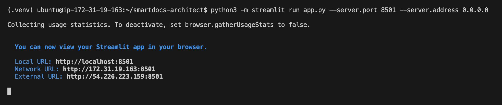

# SmartDocs Architect
> Final Project for EMGT 308 - Solutions Architecture and the Cloud


## Project Overview
SmartDocs Architect is a cloud-hosted AI-powered document intelligence system built using Retrieval-Augmented Generation (RAG).

It allows users to upload documents, convert them into vector embeddings, retrieve semantically relevant context, and ask grounded questions based only on uploaded content.

The current MVP is deployed on AWS EC2 as a single-instance cloud workload.


## Live Demo

Cloud Deployment (AWS EC2): http://54.226.223.159:8501/


## Course Alignment
This project demonstrates core EMGT 308 concepts:
- Cloud deployment on AWS EC2
- Workload hosting in cloud infrastructure
- Layered solution architecture
- Infrastructure and application separation
- Scalable architecture planning


## Features
- Upload PDF and TXT files
- Parse and chunk document text
- Generate embeddings using Gemini API
- Store vectors in ChromaDB
- Ask grounded questions
- Display retrieved source chunks
- Clear knowledge base


## Implemented Architecture

|   |
|:-:|
| User |
| &darr; |
| Internet |
| &darr; |
| AWS EC2 Instance |
| &darr; |
| Streamlit Application |
| &darr; |
| Gemini API + ChromaDB |


## Proposed Scalable Architecture

|   |
|:-:|
| User |
| &darr; |
| Application Load Balancer |
| &darr; |
| Auto Scaling Group |
| &darr; |
| Multiple EC2 Instances |
| &darr; |
| Amazon S3 |


## Technology Stack
- Python
- Streamlit
- Gemini API
- ChromaDB
- PyPDF
- python-dotenv
- AWS EC2


## Project Structure

```text
SmartDocs Architect/
│
├── app.py
├── requirements.txt
├── README.md
├── .gitignore
├── .env.example
│
├── app/
│   ├── __init__.py
│   ├── ingest.py
│   ├── rag.py
│   ├── parsers.py
│   └── utils/
│       ├── __init__.py
│       └── helpers.py
│
├── docs/
│   └── architecture-notes.md
│
├── screenshots/
└── chroma_db/
```


## System Flow
1. Upload document  
2. Parse text  
3. Chunk content  
4. Generate embeddings  
5. Store vectors  
6. Ask question  
7. Retrieve relevant chunks  
8. Generate grounded answer  


## AWS Deployment
- Ubuntu EC2 instance
- Security Group:
  - SSH (22)
  - TCP 8501
- Streamlit served externally

Mac / Linux: 
```bash
python3 -m streamlit run app.py --server.port 8501 --server.address 0.0.0.0
```

Windows: 
```bash
python -m streamlit run app.py --server.port 8501 --server.address 0.0.0.0
```

```bash
py -m streamlit run app.py --server.port 8501 --server.address 0.0.0.0
```


## Public Access

```text
http://54.226.223.159:8501
```


## Screenshots

### Application UI


### AWS EC2 Deployment


### SSH Access


### Streamlit Running



## Video Demonstration

[](https://youtu.be/MLLgwZVvE4Q)

YouTube: https://youtu.be/MLLgwZVvE4Q


## Limitations
- Single EC2 instance
- Local vector persistence
- No authentication


## Future Improvements
- Elastic IP
- Load Balancer
- Auto Scaling
- Amazon S3 storage


## Author
Wineel Wilson Dasari


## License

[MIT License](LICENSE)
